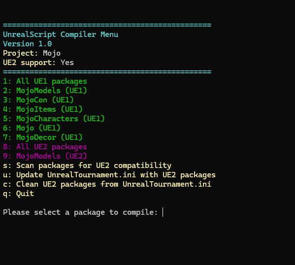

# MojoMake

MojoMake is a small command-line helper for compiling UnrealScript packages for Deus Ex projects. It automates preparing .ini entries, backing up and removing .u files, scanning .uc files for UE2 compatibility, and invoking the Unreal `UCC`/`UED22` compilers.

Features
- Creates and maintains a `MojoMake.ini` configuration file for your project
- Scans project packages and detects UE2-compatible source blocks
- Updates `DeusEx.ini` and (optionally) `UnrealTournament.ini` from UnrealEd 2.2 with compatible package entries
- Backs up and removes existing `.u` files before compiling, and moves compiled files to the project `System` folder
- Processes version-specific comment markers in `.uc` files (BEGIN/END UE1 / UE2) so the same sources can be compiled for both UE1 and UE2.2
- Interactive cli based menu for selecting single packages or compiling all packages

How to use
On first run MojoMake will prompt for a project name and the game path and create `MojoMake.ini`.
IMPORTANT: Ensure your game path contains the expected layout (e.g. `System`, `UED22` for UE2 tools, the main project folder, and the project `Classes` folder with `.uc` files).

Once configured, 
   - `1` : Compile all UE1 packages
   - Numeric entries correspond to individual packages listed in the menu (UE1 and UE2 lists)
   - `s` : Scan packages (from your project.ini) for UE2 compatibility and adds detected UE2 packages
   - `u` : Update `UnrealTournament.ini` with found UE2 packages from the project (when UE2 support is available)
   - `c` : Cleans\Removes project UE2 packages from `UnrealTournament.ini`
   - `q` : Quit

MojoMake will add/remove `EditPackages` entries in the appropriate `.ini` files and invoke `UCC.exe` (or `UED22/UCC.exe`) to perform compilation. Backups of removed `.u` files are saved with a `.bak` suffix.

Notes
- This tool is designed around the Deus Ex / UnrealScript build workflow and expects the standard game directory layout (should work with any ue1 game though, but not tested yet)
- UE2 support is optional and requires a `UED22` directory with `UCC.exe` and `UnrealTournament.ini`.

License
See project source files for licensing information.

